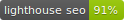

[](https://app.netlify.com/sites/gatsby-starter-typescript-tailwind-netlifycms/deploys)




# Gatsby Starter for TypeScript, TailwindCSS, and Netlify CMS

## Getting Started

```
$ npm i
$ npm start
```

### Setting up the CMS

Follow the [Netlify CMS Quick Start Guide](https://www.netlifycms.org/docs/quick-start/#authentication) to set up authentication, and hosting.

## Dependency Notes

- [CLSX](https://github.com/lukeed/clsx) - Helps with logic heavy construction of class attributes for css.

# TODO:

- Evalute article description field / excerpt?
- Verify blog styles / write example blogs
- Have netlifycms start with start command
- Swap googlefonts with typeface
- Better way to add icons to header links
- Move Logo to CMS
- Move Favicon to CMS
- Move More Content to CMS
- Make sure the netlify relative CMS plugin doesn't conflict with links in markdown (/blog went to ../blog)
- Future blog publishes
- Work on TODOs
- Clean Up Readme
- Move all theme styles to CMS data
- Consider consolidating 404 and thanks page to a generic page "type" with title / subtitle
- Consider moving layout to templates?
- Add ESLint
- Add stricter TS?
- Bundle Optimization
- Add Preact?
- Do lighthouse checks
- Optimize css dev changes, seem to make dev process hang on any css change
- Improve preview
- storybook?
- unit tests?
- describe dependencies and usefulness
- Templatize it for plug and play
- Figure out why lighthouse badges doesn't work with locally installed npx
